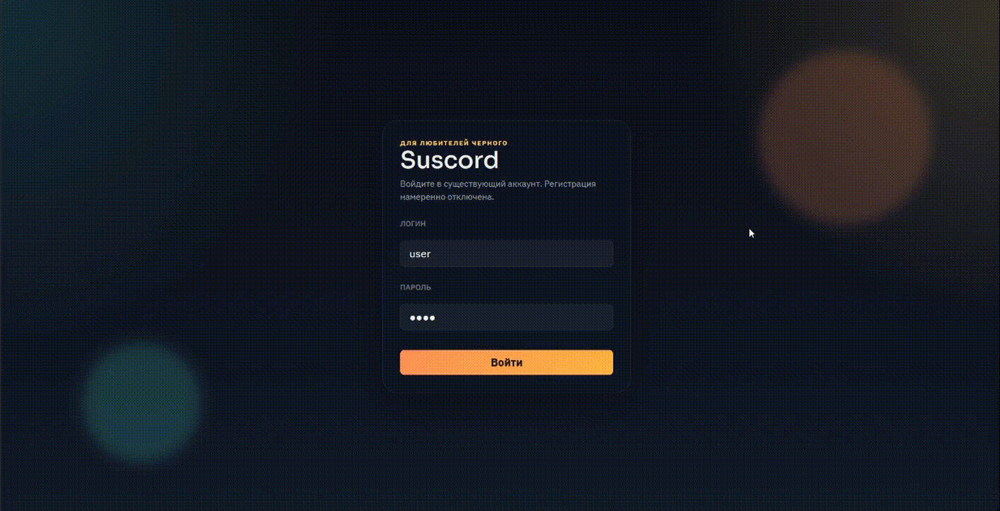

# Suscord

Pet-проект наподобие Discord: текстовые каналы, realtime-общение и звонки в одном приложении.

Frontend для проекта писал не полностью самостоятельно: в его разработке использовалась помощь AI.

Отдельной регистрации в проекте нет: новые пользователи создаются автоматически при авторизации.



## Стек

### Backend

- Go
- Echo v4
- SQLite
- WebSocket

### Frontend

- TypeScript
- React

### Realtime / Calls

- LiveKit для голосовых звонков и демонстрации экрана

## Структура проекта

- `suscord-backend` - backend-сервис
- `suscord-frontend` - frontend-приложение
- `docker-compose.yml` - запуск всего проекта одной командой
- `livekit.yaml` - локальная конфигурация LiveKit для звонков и screen sharing

## Локальный запуск

Проект можно поднять целиком из корня репозитория:

```bash
docker compose up --build
```

Или запустить в фоне:

```bash
docker compose up -d --build
```

После запуска будут доступны:

- frontend: `http://localhost:5173`
- backend API: `http://localhost:8000`
- LiveKit: `ws://localhost:7880`

Что поднимает compose:

- `frontend` - Vite dev server для React-приложения
- `backend` - Go API c SQLite и WebSocket
- `livekit` - сервер звонков и демонстрации экрана

Данные backend сохраняются в локальные директории:

- `suscord-backend/database`
- `suscord-backend/logs`
- `suscord-backend/src/assets/media`

## Что используется в проекте

- WebSocket для realtime-обновлений и обмена событиями
- SQLite как простая локальная база данных
- LiveKit для созвонов и screen sharing
- React + TypeScript для клиентской части
- Go + Echo v4 для API и серверной логики
